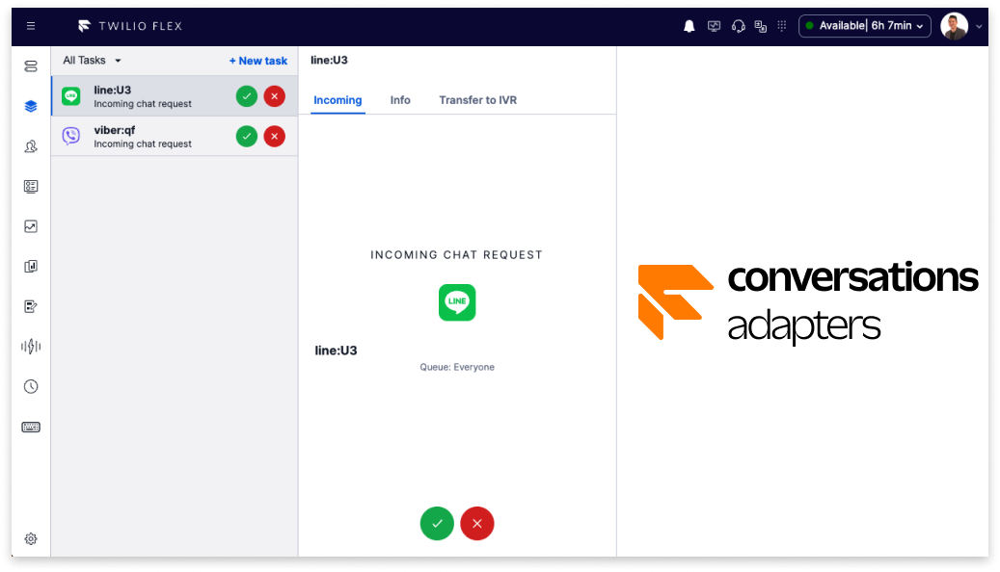

# Twilio Flex - Conversations Adapters

<!-- ALL-CONTRIBUTORS-BADGE:START - Do not remove or modify this section -->

<!-- ALL-CONTRIBUTORS-BADGE:END -->

_**Conversations Adapters**_ is a comprehensive framework designed to facilitate custom channel development for Twilio Flex using Twilio Conversations. This project empowers developers with a collection of pre-built connectors while also offering extensive extendibility options, enabling seamless integration with existing channels and facilitating the creation of new connectors.

    

## Pre-Built Connectors

- LINE
- Viber

## Documentation Page

Conversations Adapters: [Conversations Adapters Documentation Page](https://leroychan.github.io/twilio-flex-conversations-adapters)

---

## Contributors

<!-- ALL-CONTRIBUTORS-LIST:START - Do not remove or modify this section -->
<!-- prettier-ignore-start -->
<!-- markdownlint-disable -->
<table>
  <tbody>
    <tr>
      <td align="center" valign="top" width="14.28%"><a href="https://github.com/leroychan"> <b>Leroy Chan</b></a> <a href="#plugin-leroychan" title="Plugin/utility libraries">🔌</a></td>
      <td align="center" valign="top" width="14.28%"><a href="https://github.com/chaosloth"> <b>Christopher Connolly</b></a> <a href="#plugin-chaosloth" title="Plugin/utility libraries">🔌</a></td>
    </tr>
  </tbody>
</table>

<!-- markdownlint-restore -->
<!-- prettier-ignore-end -->

<!-- ALL-CONTRIBUTORS-LIST:END -->
<!-- prettier-ignore-start -->
<!-- markdownlint-disable -->

<!-- markdownlint-restore -->
<!-- prettier-ignore-end -->

<!-- ALL-CONTRIBUTORS-LIST:END -->

---

## License

MIT

## Disclaimer: Open Source Project

Conversations Adapters is an open source project and is not affiliated, endorsed, or associated with Twilio in any manner. This project is maintained and developed by independent contributors who aim to provide a comprehensive framework and collection of connectors for chat-based channels. While Conversations Adapters may support integration with various chat platforms, it is not officially supported or endorsed by Twilio. Any references made to Twilio or its products within this project are purely for informative purposes. For official support or inquiries related to Twilio, please refer to their official documentation and support channels.
