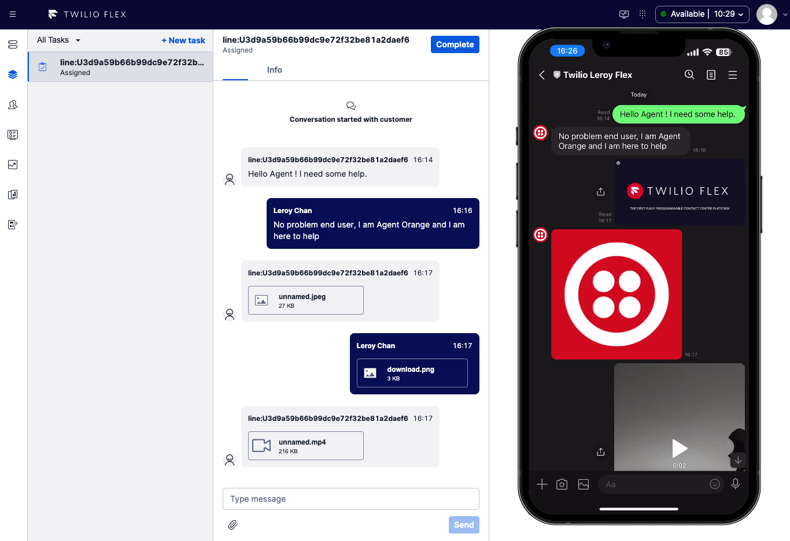
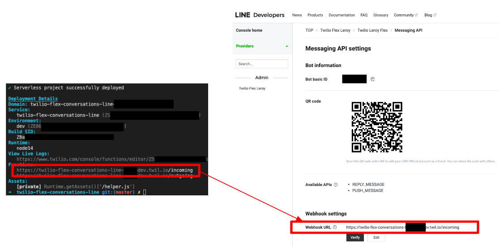
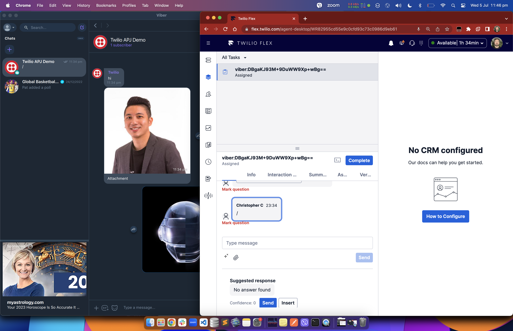
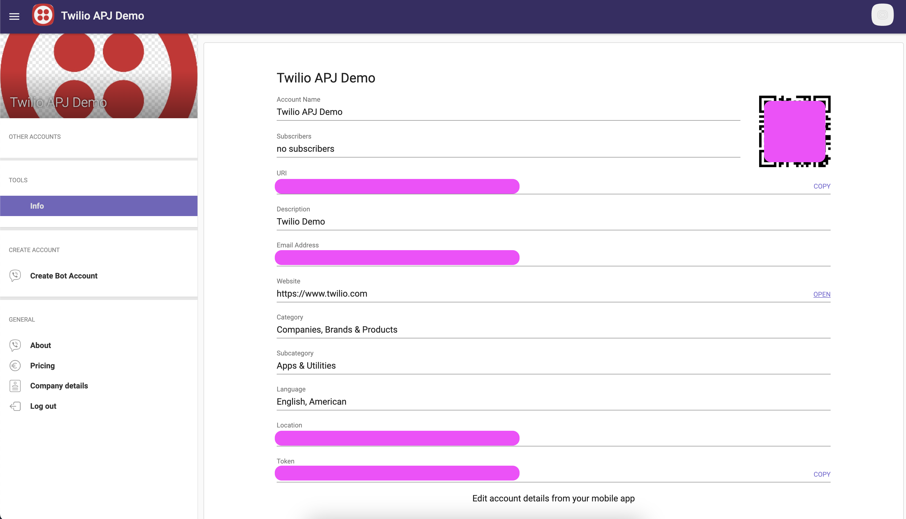

# Twilio Flex - Conversations Adapters

<!-- ALL-CONTRIBUTORS-BADGE:START - Do not remove or modify this section -->

[](#contributors-)

<!-- ALL-CONTRIBUTORS-BADGE:END -->

[](https://github.com/leroychan/twilio-flex-conversations-adapters/blob/master/LICENSE.md)[](https://prettier.io)

The _Twilio Flex Conversations Adapters_ project provides a framework for custom channel development for Twilio Flex 2.0 using Twilio Conversations.

## Supported Channels

- [LINE Official Account (OA)](#channel-line)
- [Viber](#channel-viber)

|                            | LINE                   | Viber              |
| -------------------------- | ---------------------- | ------------------ |
| Text                       | :white_check_mark:     | :white_check_mark: |
| Images (.png, .jpeg, .jpg) | :white_check_mark:     | :white_check_mark: |
| Videos (.mp4, .mpeg)       | :white_check_mark:     | :white_check_mark: |
| Files (.pdf, .txt)         | :large_orange_diamond: | :white_check_mark: |
| Emoji                      | :red_circle:           | :red_circle:       |
| Stickers                   | :red_circle:           | :red_circle:       |

_Legends:_

- :white_check_mark: Supported
- :large_orange_diamond: Partial Support
- :red_circle: Not Supported in this project but can be implemented

---

## Getting Started

This project provides 2 different ways of deploying the _Twilio Flex - Conversations Adapters_.

1. **[GitHub Actions (Recommended)](#deploy-option-1-github-actions-recommended)**: Provides out-of-the-box building of projects and release pipeline through [GitHub Actions](https://docs.github.com/en/actions/quickstartt)
2. **[Locally from your computer](#deploy-option-2-locally-from-your-computer)**: Using [Twilio's Serverless Toolkit](https://www.twilio.com/docs/labs/serverless-toolkit) for deployment to hosted Flex via your computer locally

---

### Deploy Option 1: GitHub Actions (Recommended)

#### Pre-requisites

- Twilio Flex Account ([Guide](https://support.twilio.com/hc/en-us/articles/360020442333-Setup-a-Twilio-Flex-Account))
- GitHub Account ([Guide](https://docs.github.com/en/get-started/signing-up-for-github/signing-up-for-a-new-github-account))
- Credentials for the different custom channels

#### Step-by-Step Instructions

1. [Fork this GitHub repository](https://github.com/leroychan/twilio-flex-conversations-adapters/fork) into your own GitHub account
1. Set the forked GitHub repository to be a **public repository** as GitHub Actions is only [free for public repositories](https://docs.github.com/en/billing/managing-billing-for-github-actions/about-billing-for-github-actions).
1. Navigate to your [Twilio Console](https://console.twilio.com/) to create your Twilio API Key and API Secret ([Guide](https://www.twilio.com/docs/glossary/what-is-an-api-key#how-can-i-create-api-keys)).
   - You will need to obtain the following before proceeding:
     - `TWILIO_ACCOUNT_SID`: Twilio Account SID that you are deploying to
     - `TWILIO_API_KEY`: Twilio API Key
     - `TWILIO_API_SECRET`: Twilio API Secret
1. For each custom channel that you would like to enable, it is recommended that you create 1 Studio per custom channel ([Guide](#how-to-create-studio-flow)).
   - You will need to obtain **atleast one** of the following before proceeding:
     - `LINE_STUDIO_FLOW_SID`: LINE Studio Flow SID
     - `VIBER_STUDIO_FLOW_SID`: Viber Studio Flow SID
   - For channels that you **do not** want to enable, you **do not** need to create the Studio Flow.
1. For each custom channel that you would like to enable, perform the required setup and configuration. The required parameters per custom channel can also be found in the `.env.example` file at the root of the repository.
   - [LINE Setup](#line-setup)
   - [Viber Setup](#viber-setup)
1. Within GitHub Console, navigate to the repository that you have forked, click on `Settings > Environment > New Environment` and add the following **secrets** with the value you have obtained from the previous step:
   - `TWILIO_ACCOUNT_SID`
   - `TWILIO_API_KEY`
   - `TWILIO_API_SECRET`
   - To enable LINE:
     - `LINE_STUDIO_FLOW_SID`
     - `LINE_CHANNEL_ID`
     - `LINE_CHANNEL_SECRET`
     - `LINE_CHANNEL_ACCESS_TOKEN`
   - To enable Viber:
     - `VIBER_STUDIO_FLOW_SID`
     - `VIBER_AUTH_TOKEN`
1. Within GitHub Console, navigate to the repository that you have forked, click on `Actions > Deploy to Flex > Run workflow`. Select the environment that you have created previously and click `Run workflow`
1. The workflow will run to build, compile and process all the required components and deploy it to your chosen environment (i.e. Flex Account). You can also click on each of the workflow runs to view the logs.
1. Within [Twilio Console](https://console.twilio.com/), on the left hand side menu bar, navigate to `Functions and Assets > Services`. Look for `twilio-flex-conversations-adapters` and click on `Service Details`. Under `Environments > Domain`, take note of the domain URL.
   - The domain URL should be in the format of `twilio-flex-conversations-adapters-RANDOMNUMBER-dev.twil.io`.
1. Use the following `incoming` webhook URLs:
   - `LINE`: `https://twilio-flex-conversations-adapters-RANDOMNUMBER-dev.twil.io/api/line/incoming`
   - `Viber`: `https://twilio-flex-conversations-adapters-RANDOMNUMBER-dev.twil.io/api/viber/incoming`
1. Configure each custom channel's webhook setting in their respective console
   - [LINE Setup](#line-setup)
   - [Viber Setup](#viber-setup)
1. You have now completed the setup. Proceed to test the integration by logging into your Flex Agent console and put yourself as `Available`. Send a test message to your custom channnel and it should appear in your Flex Agent console.

---

### Deploy Option 2: Locally from your computer

#### Pre-requisites

1. Twilio Flex Account ([Guide](https://support.twilio.com/hc/en-us/articles/360020442333-Setup-a-Twilio-Flex-Account))
2. Node.js v16.x.x only ([Guide](https://docs.npmjs.com/downloading-and-installing-node-js-and-npm))
3. Typescript v.5.1.6 or above ([Guide](https://www.typescriptlang.org/download))
4. Twilio CLI v5.8.1 or above ([Guide](https://www.twilio.com/docs/twilio-cli/quickstart))
5. Twilio CLI Serverless Plugin v3.1.3 or above ([Guide](https://www.twilio.com/docs/labs/serverless-toolkit/getting-started))

#### Step-by-Step Instructions

1. On your computer, open up your preferred terminal and clone this repository

   - ```bash
     // Clone Project
     git clone https://github.com/leroychan/twilio-flex-conversations-adapters.git

     // Change to working directory
     cd twilio-flex-conversations-adapters

     // Install NPM Packages
     npm install

     // Copy sample enviroment file
     cp .env.example .env
     ```

1. For each custom channel that you would like to enable, it is recommended that you create 1 Studio per custom channel ([Guide](#how-to-create-studio-flow)).
   - You will need to obtain **atleast one** of the following before proceeding:
     - `LINE_STUDIO_FLOW_SID`: LINE Studio Flow SID
     - `VIBER_STUDIO_FLOW_SID`: Viber Studio Flow SID
   - For channels that you **do not** want to enable, you **do not** need to create the Studio Flow.
1. For each custom channel that you would like to enable, perform the required setup and configuration. The required parameters per custom channel can also be found in the `.env.example` file at the root of the repository.
   - [LINE Setup](#line-setup)
   - [Viber Setup](#viber-setup)
1. Configure the `.env` file using your preferred code editor with all the required values obtained previously. You can leave `ACCOUNT_SID=xxx` and `AUTH_TOKEN=xxx` empty as it will be populated by default during run time. Before you deploy, ensure that `twilio profiles:list` has an active account set.
   - To enable LINE:
     - `LINE_STUDIO_FLOW_SID`
     - `LINE_CHANNEL_ID`
     - `LINE_CHANNEL_SECRET`
     - `LINE_CHANNEL_ACCESS_TOKEN`
   - To enable Viber:
     - `VIBER_STUDIO_FLOW_SID`
     - `VIBER_AUTH_TOKEN`
1. Once configured and you are ready to deploy it, go back to your terminal and issue the following
   command:
   - ```bash
     npm run deploy
     ```
1. Within [Twilio Console](https://console.twilio.com/), on the left hand side menu bar, navigate to `Functions and Assets > Services`. Look for `twilio-flex-conversations-adapters` and click on `Service Details`. Under `Environments > Domain`, take note of the domain URL.
   - The domain URL should be in the format of `twilio-flex-conversations-adapters-RANDOMNUMBER-dev.twil.io`.
1. Use the following `incoming` webhook URLs:
   - `LINE`: `https://twilio-flex-conversations-adapters-RANDOMNUMBER-dev.twil.io/api/line/incoming`
   - `Viber`: `https://twilio-flex-conversations-adapters-RANDOMNUMBER-dev.twil.io/api/viber/incoming`
1. Configure each custom channel's webhook setting in their respective console
   - [LINE Setup](#line-setup)
   - [Viber Setup](#viber-setup)
1. You have now completed the setup. Proceed to test the integration by logging into your Flex Agent console and put yourself as `Available`. Send a test message to your custom channnel and it should appear in your Flex Agent console.

---

## How To: Create Studio Flow

It is recommended to create 1 Studio Flow per custom channel.

1. Login to [Twilio Console](https://console.twilio.com/) and under `Studio`, create a new Studio Flow. It is advisable to create 1 Studio Flow per Custom Channel.
1. Within the Studio Flow, drag-and-drop the `Send to Flex` widget and configure the `Workflow` and `Task Channel` accordingly. For `Task Channel`, please choose either `Chat` or `Programmable Chat`.
1. Once created, connect the `Incoming Conversation` trigger to `Send to Flex` widget and click `Publish`.
1. The Studio Flow should be configured similar to the screenshot below:
   - 

---

## Channel: LINE

_Twilio Flex 2.0 - LINE Channel_ is a custom channel connector to enable LINE as a conversation channel in Flex 2.0. It uses Twilio Functions as a middleware between [LINE Messaging API](https://developers.line.biz/en/docs/messaging-api/) and Twilio Flex.



### Supported Message Types

|                            |      User to Flex Agent       |      Flex Agent to User       |
| -------------------------- | :---------------------------: | :---------------------------: |
| Text                       |      :white_check_mark:       |      :white_check_mark:       |
| Images (.png, .jpeg, .jpg) |      :white_check_mark:       |      :white_check_mark:       |
| Videos (.mp4, .mpeg)       |      :white_check_mark:       |      :white_check_mark:       |
| Files (.pdf, .txt)         |        :no_entry_sign:        |        :no_entry_sign:        |
| Emoji                      | :negative_squared_cross_mark: | :negative_squared_cross_mark: |
| LINE Sticker               | :negative_squared_cross_mark: | :negative_squared_cross_mark: |

_Legends:_  
:white_check_mark: Supported  
:negative_squared_cross_mark: Not Supported in this project but can be implemented  
:no_entry_sign: Not Supported due to limitations on LINE Messaging API

### LINE Setup

Login to [LINE Developer Console](https://developers.line.biz/console/) and create a `LINE - Messaging API Channel`.

You will need the following before proceeding:

1. LINE Channel ID (Under `Basic Settings`)
2. LINE Channel Secret (Under `Basic Settings`)
3. LINE Channel Access Token (Under `Messaging API`)

#### LINE Webhook

After you have successfully deployed the Twilio Function, copy the the entire API path of `/api/line/incoming` and head to [LINE Developer Console](https://developers.line.biz/console/) to configure the webhook setting. You can find the webhook setting under `LINE Developer Console > Channel > Messaging API`.



Next, please navigate to `LINE Developer Console > Settings > Response settings` and disable `Chat`, `Greeting message` and `Auto-response messages`. Please ensure `Webhooks` is enabled.

---

## Channel: VIBER

_Twilio Flex 2.0 - VIBER Channel_ is a custom channel connector to enable Viber as a conversation channel in Flex 2.x It uses Twilio Functions as a middleware between [Viber API](<https://developers.viber.com/docs/api/rest-bot-api/#get-started](https://developers.viber.com/docs/api/rest-bot-api/#get-started)>) and Twilio Flex.



### Viber Setup

1. Create Viber developer account - https://developers.viber.com/
2. Create a bot - https://partners.viber.com/account/create-bot-account
3. Complete required fields and copy secure token
4. Put token in `VIBER_AUTH_TOKEN` under GitHub - Environments - Secrets (GitHub Actions Deployment) or within `.env` file `VIBER_AUTH_TOKEN` (Local Deployment)
5. Configure Viber webhook

#### Viber Webhook

Once the Twilio serverless function is deployed, obtain the host name and send a POST request to Viber's Webhook URL (`https://chatapi.viber.com/pa/set_webhook`)

Note: Remember to set the `X-Viber-Auth-Token` HTTP header to the previously obtained token in step 3

URL:

```json
{
  "url": "https://<YOUR_HOST_NAME>.twil.io/api/viber/incoming",
  "event_types": [
    "message",
    "delivered",
    "seen",
    "failed",
    "subscribed",
    "unsubscribed",
    "conversation_started"
  ],
  "send_name": true,
  "send_photo": true
}
```



---

## Contributors

<!-- ALL-CONTRIBUTORS-LIST:START - Do not remove or modify this section -->
<!-- prettier-ignore-start -->
<!-- markdownlint-disable -->
<table>
  <tbody>
    <tr>
      <td align="center" valign="top" width="14.28%"><a href="https://github.com/leroychan"><br /><sub><b>Leroy Chan</b></sub></a><br /><a href="#plugin-leroychan" title="Plugin/utility libraries">🔌</a></td>
      <td align="center" valign="top" width="14.28%"><a href="https://github.com/chaosloth"><br /><sub><b>Christopher Connolly</b></sub></a><br /><a href="#plugin-chaosloth" title="Plugin/utility libraries">🔌</a></td>
    </tr>
  </tbody>
</table>

<!-- markdownlint-restore -->
<!-- prettier-ignore-end -->

<!-- ALL-CONTRIBUTORS-LIST:END -->
<!-- prettier-ignore-start -->
<!-- markdownlint-disable -->

<!-- markdownlint-restore -->
<!-- prettier-ignore-end -->

<!-- ALL-CONTRIBUTORS-LIST:END -->

---

## License

MIT
